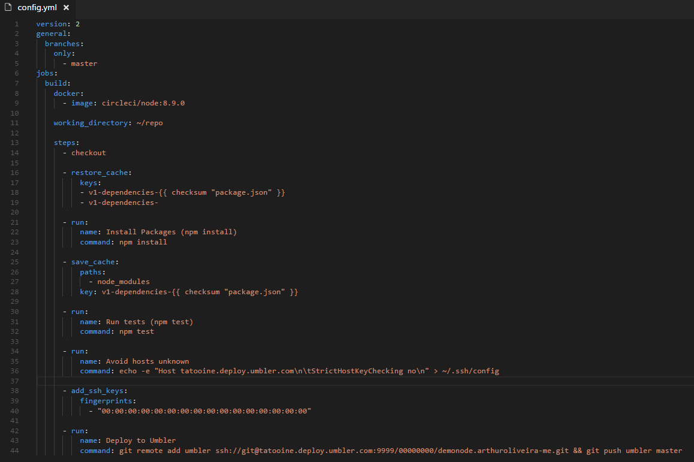
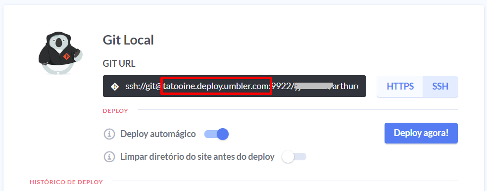

# Sobre o Projeto
Essa é uma demonstração de como configurar CI/CD utilizando o Circle CI para build, teste e deploy automático via GIT em um site NodejS na Umbler.com.

Mas você deve pensar: O que eu ganho com isso já que posso realizar o deploy diretamente via git na Umbler?  
Utilizando uma ferramenta de CI/CD você pode configurar um pipeline que inclua procedimentos de build, teste, lint e qualquer outra etapa necessária antes de realizar o deploy. Além disso, você não precisa compartilhar a senha ou chave SSH da Umbler com outras pessoas envolvidas no dev.

Outra vantagem interessante é que o pipeline pode ser configurado para agir de formas diferentes dependendo da branch, por exemplo. Assim vc pode realizar build e testes na branch ```develop``` e apenas publicar a ```master``` por exemplo.

Nesse exemplo vamos utilizar o CircleCI por causa da franquia no plano gratuito. Enquanto escrevo essas instruções, o plano gratuito permite um único job (sem concorrência) e 1500 minutos de build por mês. Se usar com moderação, é o bastante pra vários projetos. 

## Requisitos
- [X] Site NodeJs no Umbler.com
- [X] Conta gratuita no circleci.com
- [X] Ambiente de dev contendo NodeJs e editor (VSCode, ST, Atom, etc)

## Configurando o CI/CD
Como o que importa aqui é o procedimento para configurar o CircleCI, eu utilizei um mini servidor web utilizando ExpressJs (pasta ```server```) e uma página estática (```client```) sem nenhuma implementação relevante. Se executar o comando ```npm start``` vc verá apenas uma página de Hello World.

Para configurar corretamente a publicação via CircleCI, temos as seguintes etapas:
1. Criar uma chave SSH na sua máquina local ([mais detalhes aqui](https://help.umbler.com/hc/pt-br/articles/206576653)). Importante: Não informe senha para essa chave.
2. Acessar a tela de [Chaves SSH](https://app.umbler.com/ssh-keys) e adicionar uma nova chave. Informe um título e cole no campo "Chave" o conteúdo da chave *publica* (arquivo .pub gerado na etapa anterior).
3. Acesse o dashboard do CircleCI (https://circleci.com/dashboard), clique em *Projects* e no botão *Add Project*.
4. Se a integração com Github foi configurada corretamente na criação da conta do CircleCi, serão listados todos os projetos da sua conta no Github. Clique no botão *Setup Project* do projeto que deseja configurar o CI/CD.
5. Como a configuração será feita utilizando o arquivo ```.circleci/config.yml```, pode rolar até a etapa 5 e clicar em Start Build.
6. Feita as etapas acima, possivelmente o processo irá falhar o parar aguardando usuário e senha. Relaxa! Ainda falta coisa pra fazer...  Cancele o build se ainda estiver com status "Running".
7. Clique em *Projects* para ter acesso ao projeto que acabamos de incluir. Clique no botão "Settings" do projeto.
8. Na barra lateral, localize a opção "SSH Permissions" e clique em "Add ssh key".
9. Copie o conteúdo da chave *privada* (arquivo gerado na etapa 1, sem ser o arquivo com extensão .pub). OBS: O campo hostname é opcional. Caso não seja informado, a chave poderá ser utilizada para qualquer hostname. Nesse nosso caso pode ser deixado em branco.
10. Importante! Após concluir a etapa 9, vc verá o Fingerprint dessa chave. Copie esse valor, pois vamos precisar logo mais.

Com as etapas acima nós configuramos uma chave SSH na Umbler.com para permitir o acesso sem usuário/senha, configuramos o projeto no CircleCI e também a chave SSH para que o CircleCI possa interagir com a Umbler.

Agora precisamos fazer configurar o projeto para que o CircleCI saiba o que fazer com ele. Essa configuração é feita no arquivo ```.circleci/config.yml```.

Vamos ao arquivo ```config.yml```:


Linha 3 a 5: Restringimos o processo a branch ```master```. Isso é bom para não consumirmos os minutos gratuitos com qualquer commit.

Linha 9: Qual imagem docker será utilizado. Nesse caso estou usando o Node 8.9.0

Linha 14: Clona o repositório GIT do Github.

Linha 16 a 19: Instruimos a utilizar cache, se houver, da pasta ```node_modules```. Com isso ganhamos mais uns minutos de build :-)

Linha 21 a 23: O bom e velho ```npm install```.

Linha 25 a 28: Instruimos a gravar cache da pasta ```node_modules``` para ser reutilizado no próximo build.

Linha 30 a 32: Executa testes.

Linha 34 a 36: Essa parte é *muito* importante. Nela configuramos o SSH da máquina de build para o host da Umbler que serve os GITs. Se não for feito isso, o login via SSH não vai funcionar :-/
OBS: Acredito que esse nome de host não mude. Mas você pode confirmar esse endereço acessando https://app.umbler.com, selecionando o site NodeJS e observando a URL do repositório. O host é apenas a parte destacada de vermelho no exemplo abaixo:


Linha 28 a 40: Lembra do Fingerprint que pedi pra anotar na etapa 10? Atualize essa parte com o fingerprint correto.

Linha 42 a 44: Por último, e não menos importante, temos o deploy. Nesse trecho do arquivo nós fazemos o que é instruído no Painel de Controle da Umbler para deploy via git. Mas com um detalhe: Deve ser utilizado a URL SSH, e não HTTPS. Na linha 44 atualize a URL SSH com a URL que é informada no Painel de Controle da Umbler.com.

Lembrando que muitas outras etapas podem ser configuradas, e os processos abaixo podem ser otimizados. Esse é apenas um exemplo funcional... 

Se tudo der certo e vc tiver fé, estamos prontos para realizar um teste. Assim que vc realizar esses ajustes, der um commit e push para o github, um novo build será iniciado no Circle CI.  

Com esse config.yml o CircleCI vai realizar um git clone, npm install, npm run test e, se tudo der "verde", um git push para a Umbler.

Boa sorte! 